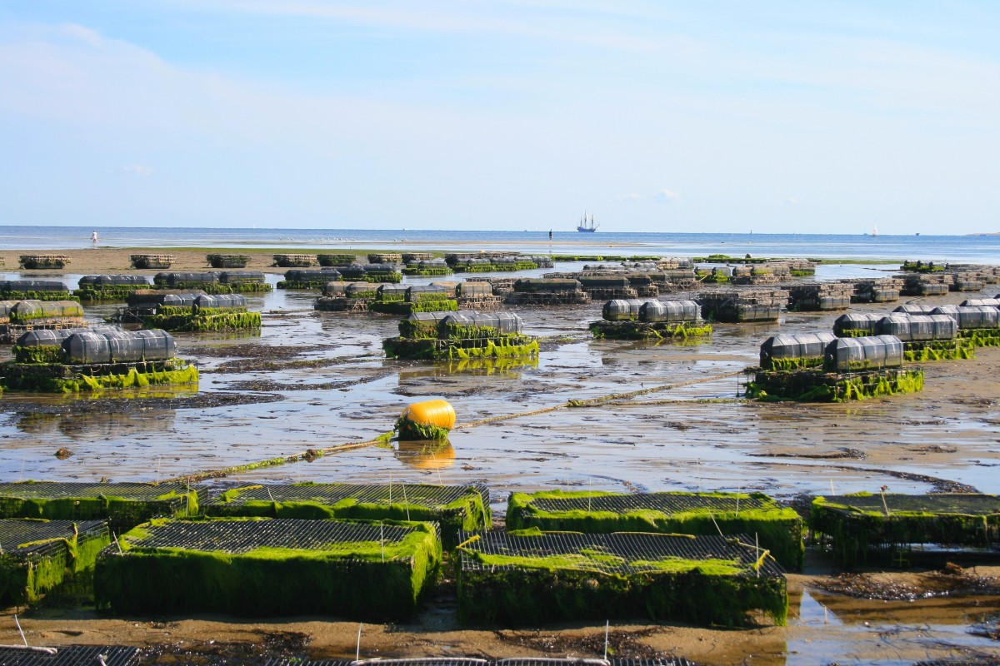

# Feasibility of marine aquaculture along the Exclusive Economic Zones (EEZ) on the West Coast of the US



# Table of Contents {#table-of-contents}

-   [Project Title](#project-title)
-   [Quickstart/Demo](#quickstartdemo)
-   [Table of Contents](#table-of-contents)
-   [Installation](#installation)
-   [File structure](#file-structure)
-   [Data](#data)
-   [Usage](#usage)
-   [Contribute](#contribute)
-   [License](#license)

# Installation {#installation}

[(Back to top)](#table-of-contents)

**Repository**: [west_coast_eez_aquaculture](https://github.com/oksanaprotsukha/west_coast_eez_aquaculture)

The analysis is written in R-language. The following tools are required to rerun the analysis:\
- R-ready environment (`RStudio`, `VSCode`),\
- The data is not included in the repo due ot its size. 

# File structure {#file-structure}

[(Back to top)](#table-of-contents)

```         
├── west_coast_eez_aquaculture.Rproj
├── README.md
├── index.Rmd
├── index.html
└── data
    ├── average_annual_sst_2008.tif
    ├── average_annual_sst_2009.tif
    ├── average_annual_sst_2010.tif
    ├── average_annual_sst_2011.tif
    ├── average_annual_sst_2012.tif
    ├── depth.tif
    ├── tl_rd22_us_state
    │   ├── tl_rd22_us_state.cpg
    │   ├── tl_rd22_us_state.dbf
    │   ├── tl_rd22_us_state.prj
    │   ├── tl_rd22_us_state.shp
    │   ├── tl_rd22_us_state.shp.ea.iso.xml
    │   ├── tl_rd22_us_state.shp.iso.xml
    │   └── tl_rd22_us_state.shx
    ├── wc_regions_clean.dbf
    ├── wc_regions_clean.prj
    ├── wc_regions_clean.shp
    └── wc_regions_clean.shx
```

# Data {#data}

[(Back to top)](#table-of-contents)

The analysis is based on the following three datasets:\

- Sea Surface Temperature\
Description: The dataset contains average annual sea surface temperature (SST) from the years 2008 to 2012. The data was originally generated from NOAA’s 5km Daily Global Satellite Sea Surface Temperature Anomaly v3.1. [4]\
- Bathymetry\
Description: The dataset provides the General Bathymetric Chart of the Oceans (GEBCO). [3]\
- Exclusive Economic Zones
Description: Shapefiles of the Exclusive Economic Zones off the west coast of the US from Marineregions.org.

# Usage {#usage}

[(Back to top)](#table-of-contents) This repo can be used to reproduce and contribute to the analysis.

# Contribute {#contribute}

[(Back to top)](#table-of-contents) Use issues to contribute to the project:

``` shell
https://github.com/oksanaprotsukha/west_coast_eez_aquaculture
```

# License {#license}

[(Back to top)](#table-of-contents)

[MIT license](./LICENSE)
